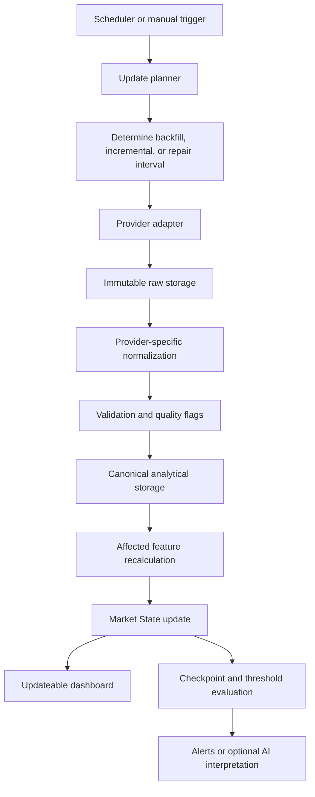

# Investment Intelligence Platform — Design Document v0.1

**Status:** Phase 0 implemented and verified
**Last review:** 2026-08-17
**Scope:** long-term architecture and Phase 0 foundation boundaries

## 1. Purpose

The Investment Intelligence Platform is a Python-first, local-first system for collecting,
historizing, validating, analyzing, and eventually interpreting market data. It is intended to
be both a useful daily research tool and a professional, public software-engineering project.

The platform follows this dependency direction:

```text
DATA
→ DETERMINISTIC ANALYTICS
→ MARKET STATE
→ AI INTERPRETATION
→ STRATEGY
→ EXECUTION
```

Quantitative facts such as returns, volatility, correlations, rankings, breadth, and signals are
computed by deterministic, reproducible code. AI may interpret those results later; it must not
replace testable numerical computation.

## 2. A living market system

The target is not:

```text
historical download → static dashboard
```

It is a system that can maintain an increasingly complete, continuously updated representation
of the market. A future dashboard must therefore consume updateable market state rather than
manually loaded snapshots. This does not imply real-time trading or HFT: the initial target
remains daily analytics, 5-minute intraday data, and configurable periodic updates.

Three ingestion intents must be supported over time:

- **Backfill:** acquire a historical interval that is absent locally.
- **Incremental update:** acquire observations after the latest successfully persisted point.
- **Repair / reconciliation:** revisit an already acquired interval to detect or correct missing
  observations, delayed data, provider corrections, corporate actions, ingestion failures, or
  inconsistencies.

**Problem to avoid:** a one-shot, full-history-only API would force repeated downloads and assume
that provider history never changes.

**Why it matters:** daily operation inevitably includes partial windows, retries, late data, and
corrections.

**Phase 0 preparation:** provider requests use explicit half-open intervals and stable instrument,
dataset, timeframe, source, and batch identities; storage is append-safe and preserves raw input.

**Deliberately deferred:** update planning, real provider adapters, normalization orchestration,
repair policies, and scheduling.

## 3. Future update and ingestion architecture

The intended control flow is:



Update cadence is a property of each dataset and use case, not of the whole platform. Examples
include 5-minute bars during regular sessions, daily bars after close, corporate actions daily,
fundamentals when available, macro data on release calendars, and news/events at a higher cadence.

**Problem to avoid:** one global schedule couples unrelated datasets and makes freshness semantics
unclear.

**Why it matters:** datasets have different publication times, correction behavior, latency, and
cost.

**Phase 0 preparation:** provenance, request intervals, session, timeframe, `available_at`,
`retrieved_at`, and `ingested_at` remain explicit.

**Deliberately deferred:** scheduler, job runner, retry/rate-limit engine, dependency graph, and
feature invalidation engine.

## 4. Watermarks and mutable ingestion state

A future ingestion watermark identifies progress for a key such as:

```text
(provider, dataset, instrument_id, timeframe, stream_dimensions...)
```

The key is dataset-specific and includes every dimension that changes the logical stream. For
price bars this includes session scope and adjustment state when they represent distinct series.

It may track at least:

- the exclusive end of the latest contiguous, successfully committed coverage;
- latest attempt;
- latest successful update;
- current status and error summary;
- optionally the repair horizon or provider cursor needed to resume.

Watermarks describe what the system has successfully processed; they are not inferred solely from
the latest timestamp present in a Parquet file. They advance only after raw persistence,
normalization, acceptable validation, and canonical analytical persistence have succeeded for the
covered interval.

**Problem to avoid:** without explicit progress state, an updater cannot reliably distinguish a
complete history from a partial or failed one.

**Why it matters:** a maximum timestamp does not capture gaps, failed pages, provider cursors, or
repair requirements.

**Phase 0 preparation:** `BarRequest` and corporate-action requests accept bounded intervals;
source, instrument, timeframe, batch, and observation time are stable and queryable.

**Deliberately deferred:** an `IngestionState` model, watermark repository, transactional updates,
and application-state database.

## 5. Idempotency and replay safety

The long-term invariant is:

> Reprocessing the same logical ingestion or stable batch must not create duplicate persisted
> observations.

Stable batch identifiers are supplied by the caller and are not regenerated by storage. Raw
artifacts include checksums. Output paths are deterministic for a batch and partition. Phase 0
provides **artifact-level idempotency**, not complete workflow or semantic idempotency. It
distinguishes:

- an exact raw replay with the same source/request identity, metadata, and checksum, which resolves
  to the existing artifact without a second copy;
- a reused batch identifier with different content or metadata, which is an integrity collision;
- a repeated normalized output path, which must never silently overwrite or create a second part;
- duplicate observations in a frame, which are flagged but not automatically resolved.

A provider correction is captured as a new immutable raw batch. A future reconciliation policy
decides which observation revision is current; it never rewrites the original raw evidence.

**Problem to avoid:** schedulers, retries, network recovery, and manual reruns make repeated work
inevitable.

**Why it matters:** duplicate bars silently corrupt returns, volume, and cross-sectional metrics.

**Phase 0 preparation:** caller-owned stable batch IDs, SHA-256 manifests, deterministic paths,
atomic publication, collision protection, and duplicate detection.

**Deliberately deferred:** logical request fingerprints, exactly-once orchestration, transactional
watermark advancement, deduplication winner policies, and repair reconciliation.

## 6. Storage responsibilities

### 6.1 Immutable raw storage

The exact provider payload is persisted before downstream use, together with a sanitized manifest
containing provenance, retrieval time, media type, size, and checksum. Raw storage is append-only;
normalization never overwrites it. Raw data may be JSON, CSV, Parquet, or another provider-native
format.

### 6.2 Parquet: canonical analytical storage

Parquet is the canonical analytical storage and source of truth for large historical datasets such
as normalized price bars, future curated/adjusted market data, observed features, and similar
columnar datasets. It is not declared the source of truth for every future kind of application
state.

### 6.3 DuckDB: analytical query engine

DuckDB reads Parquet in-process. In Phase 0 it remains in-memory and does not hold a persistent,
competing copy of canonical market data.

### 6.4 Future operational/application store

Mutable, transactional state has different requirements. A later phase may introduce a relational
store—likely PostgreSQL—for watermarks, jobs, retries, checkpoints, alerts, application
configuration, portfolio state, orders, executions, or users.

**Problem to avoid:** forcing analytical time series and mutable workflow/application state into a
single storage technology merely to preserve a prototype decision.

**Why it matters:** columnar analytics and transactional coordination optimize for different access
and consistency patterns.

**Phase 0 preparation:** filesystem, analytical storage, domain, and provider concerns remain
separate; no interface assumes DuckDB owns operational state.

**Deliberately deferred:** PostgreSQL, migrations, repositories for mutable state, and dual-store
transaction coordination.

## 7. Raw payload scalability

Serializable raw metadata and the payload resource are separate concepts. The provider boundary
uses a small `RawPayload` reader contract rather than requiring `payload: bytes` on every batch.
`RawBatchStore` consumes that reader in bounded chunks while computing the checksum. Phase 0 may
provide only an in-memory payload adapter for fixtures; future adapters can be file-backed or
stream-backed without changing batch metadata or storage APIs.

**Problem to avoid:** arbitrary bulk or deep intraday payloads being duplicated in memory.

**Why it matters:** provider page sizes and universe coverage will grow beyond small bake-off
fixtures.

**Phase 0 preparation:** a bounded-memory reader interface and chunked storage consumer, with
Pydantic reserved for serializable metadata.

**Deliberately deferred:** streaming HTTP clients, resumable downloads, multipart payloads,
backpressure, and file-backed provider implementations.

## 8. Canonical domain and time semantics

- `Instrument` owns a stable internal UUID; ticker and provider identifiers are temporal external
  identifiers, never primary keys.
- `Universe` and `UniverseMembership` model point-in-time membership using `[valid_from, valid_to)`.
- `PriceBar` includes instrument, timeframe, `[timestamp_start, timestamp_end)`, OHLC, nullable
  volume/VWAP/currency, session, adjustment state, source, batch, availability, retrieval,
  ingestion, and quality flags.
- Corporate actions are separate discriminated models for split, dividend, and ticker change;
  adjusted close is not the sole record of adjustment history.
- `FeatureDefinition` is parametric; observed features remain conceptually distinct from forecasts.
- Persisted timestamps are timezone-aware UTC. `America/New_York` interprets US Regular Trading
  Hours; daily bars describe actual sessions, not local midnight.
- `available_at` is nullable when unknown and is never silently replaced with `ingested_at`.

Phase 0 supports `1d` and `5m` without preventing additive timeframes later.

## 9. Trading calendar boundary

Phase 0 handles aware timestamps, UTC normalization, America/New_York conversion, and DST tests. A
real ingestion and provider bake-off must later account for exchange holidays, daylight saving
time, early closes, expected sessions, and calendar-aware missing-bar detection.

**Problem to avoid:** treating an exchange holiday or abbreviated session as missing/corrupt data.

**Why it matters:** clock arithmetic alone cannot define an expected trading session.

**Phase 0 preparation:** explicit timeframe/session/timezone semantics and no hard-coded assumption
that every regular session ends at 16:00.

**Deliberately deferred:** trading-calendar dependency, holiday/early-close rules, and complete
missing-bar validation.

## 10. Market State, checkpoints, and AI

The logical dependency remains:

```text
new data
→ validation
→ affected deterministic analytics/features
→ Market State update
├→ updateable dashboard
└→ checkpoint / threshold evaluation
   └→ alerts or optional AI interpretation
```

The checkpoint engine stays in its existing roadmap phase. AI agents arrive after deterministic
change detection; they are not continuous monitors for every instrument.

**Problem to avoid:** using an LLM as a high-frequency scanner or calculator across the entire
universe.

**Why it matters:** deterministic thresholds are cheaper, reproducible, and auditable, and they
provide focused context to later agents.

**Phase 0 preparation:** preserve the dependency direction and keep feature definitions separate
from forecasts or agent outputs.

**Deliberately deferred:** feature execution, Market State, checkpoints, alerts, dashboards, and AI
agents.

## 11. Phase 0 boundary

Phase 0 implements only repository/tooling foundation, durable Codex context, domain models,
provider abstraction, immutable raw storage, canonical normalized representation, Parquet storage,
DuckDB queries, validation patterns, tests, CI, and documentation.

It does not implement a real scheduler, update planner, persistent ingestion state, PostgreSQL,
retry/rate limiting, complete trading calendar, production provider, normalization pipeline,
feature executor, Market State, checkpoint engine, dashboard, agents, strategies, backtesting, or
execution.

The next roadmap step remains the previously planned provider bake-off; this review does not create
a new phase or renumber the roadmap.
